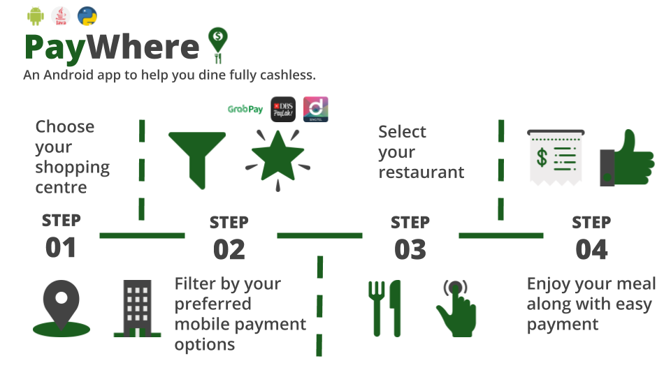
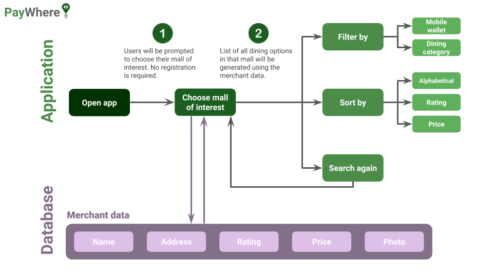
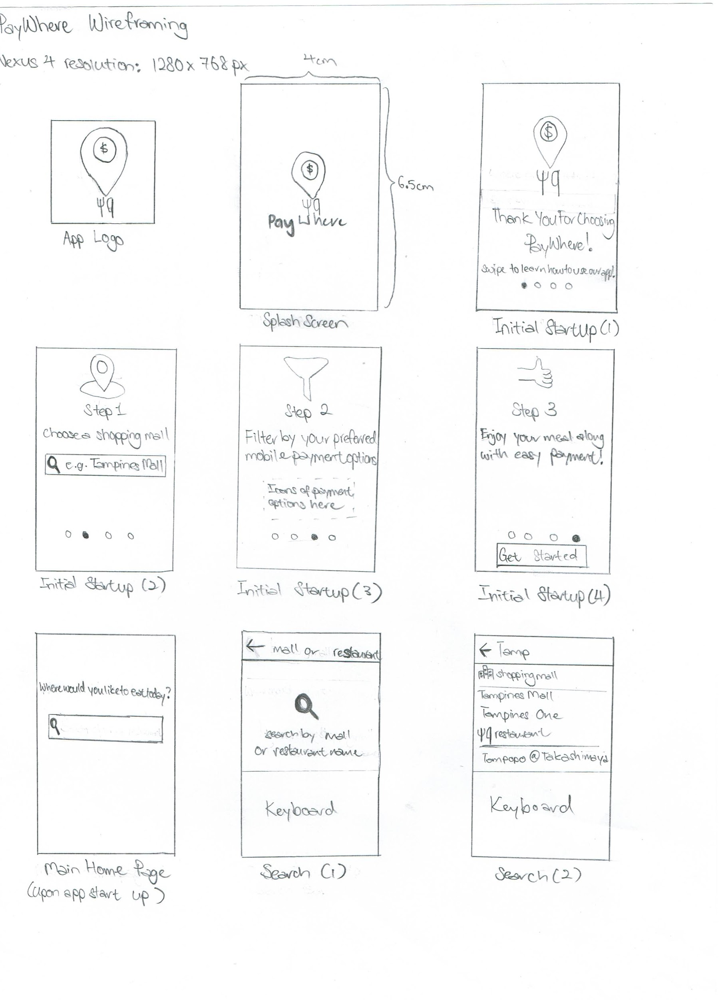
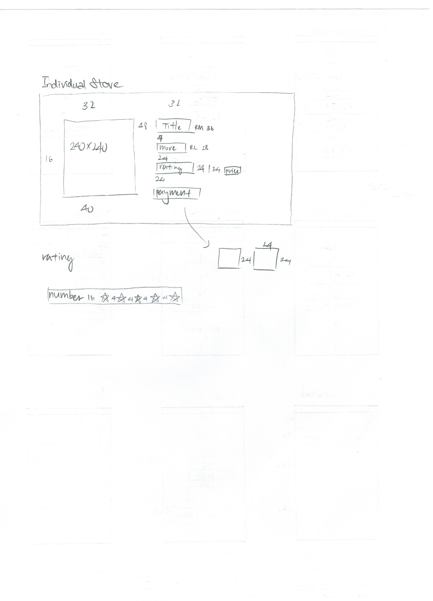
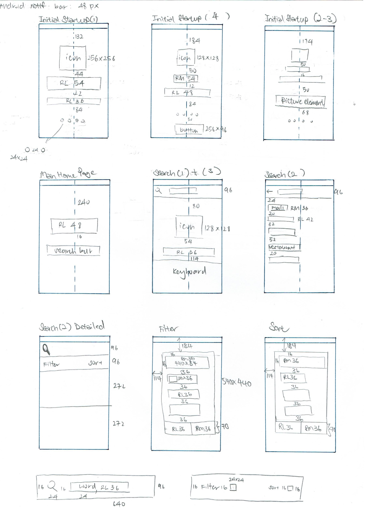
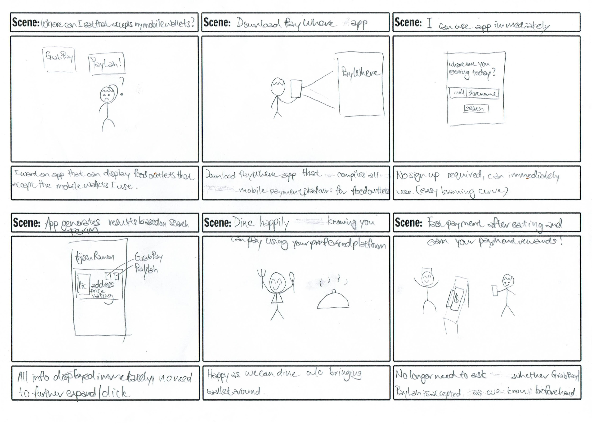
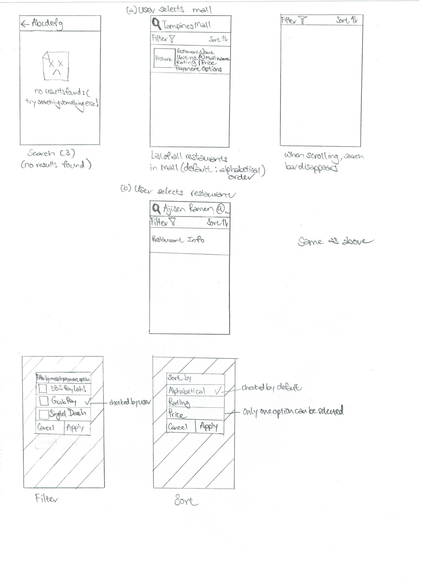

**Group:** Team Marshmallow (1775)

**Members:** Dominique Ng and Shawn Lee

**Advisor:** Kyle Timothy Chu

**Proposed Level of Achievement:** Gemini

Motivation
==========

As Singapore transitions into a cashless society, besides the usual
mobile payment options that we are familiar with such as PayLah and
GrabPay, there are also other options such as FavePay and SingtelDash.

With each mobile payment option having their **own set of merchants**,
it is impossible for people to remember whether a particular store
accepts their preferred mobile payment option. Currently, people can
visit websites of the mobile payment platforms **individually**, but
this is **inefficient** as we have to visit several websites to find out
which payment options a particular store accepts. Most people end up
enquiring about the available options only when they are making payment
at the counter. As a result of this **uncertainty**, people still end up
carrying cash around as a backup.

This led us to ponder: Are we truly on our way to a cashless society if
we still have to bring out cash in case the place we are visiting does
not accept our preferred cashless payment platform?

Aim
===

We aspire to help mobile payment users to find suitable dining outlets
in shopping centres by displaying those that accept their preferred
mobile payment option(s) through an Android application.

User Stories
============

-   As a consumer who prefers to make transactions through a specific
    mobile payment option (for convenience or loyalty points eg.
    GrabRewards), I want to be clear if my preferred option is
    accepted in the place I am going to eat

-   As a consumer who is clueless on where to eat and is looking to make
    a transaction with mobile payment(s), I want to know the options I
    have

-   As an administrator who wants to ensure that users have sufficient
    information about food outlets, I want to provide a platform for
    users to provide feedback/submit queries and be able to respond to
    them personally

Scope of Project and Development Plan
=====================================

The **Android application** provides an interface for mobile payment
users to find out which dining outlets accept their preferred mobile
payment platforms.

**Features to be completed by the middle of June:**

-   Allow users to select their mall of interest from all malls in
    Singapore

-   Incorporate data from SingtelDash (one platform first to achieve
    minimum viable product)

-   Allow users to **filter by** mobile payment platforms

-   For each dining outlet, we will display:

    -   Name, address, pictures, rating and price

-   Allow users to **sort by** alphabetical order, rating and price

**Features to be completed by middle of July:**

-   Incorporate data from PayLah! and GrabPay as well

-   Refinement to create a smoother user interface

    -   Material design by Google

    -   Animations

How are we different from similar platforms?
============================================

-   Burpple

    -   Our app will be less cluttered than Burpple as Burpple offers
        reviews on the restaurants as well as their subscription plan,
        Burpple Beyond. We will simply display the necessary
        information of the dining outlet and include the mobile
        payment accepted there as well.

-   eatigo

    -   Similar to Burpple, eatigo has many features and allows users to
        get discounts at specified times. It also allows users make
        reservations. However, it does not specify whether mobile
        payments are accepted.

Program Flow 
=============

\*Note: for stores that do not accept mobile payment, they will still be
displayed in our app but we indicate that they do not do so in order to
reduce ambiguity.

Technologies Used
=================

-   Retrieval of data

> We intend to use **Selenium** Webdriver written in **Python** to
> scrape the web pages of GrabPay, DBS PayLah and SingtelDash to
> generate a list of dining merchants. We will scrape the name and
> address of these dining outlets.
>
> As for photos, price and ratings, we intend to use **Google places
> API** to obtain these information.

-   Android App

> The actual app itself will be 100% written in native Java code.

-   Backend (Database)

> We intend to use SQLite for storage of data of food outlets and their
> respective payment options.

Wireframing and Prototypes
==========================

-   Storyboarding

-   Paper Sketches

-   Prototypes on Adobe XD

