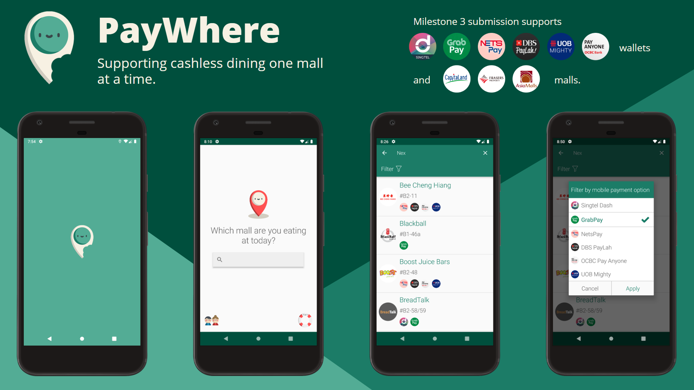

# PayWhere

PayWhere is an Android application that helps mobile payment users to
find suitable dining outlets in shopping centres by displaying those
that accept their preferred mobile payment platforms.

PayWhere contains all the information you need to dine and make payment
easily, so you don't have to trawl through multiple websites. We have
included the F&B outlet name, unit number and mobile payment platforms
accepted in an easy-to-use and elegant interface.

PayWhere currently supports:

-   33 shopping malls across Singapore
    -   Capitaland Malls
        -   Bedok Mall, Bugis Junction, Bugis+, Bukit Panjang Plaza,
            Clarke Quay, Funan, IMM, ION Orchard, JCube, Jewel Changi
            Airport, Junction 8, Lot One, Plaza Singapura, Raffles City,
            Singpost Centre, Tampines Mall, The Star Vista, Westgate
    -   Frasers Property Malls
        -   Anchorpoint, Changi City Point, Northpoint City, Robertson
            Walk, The Centrepoint, ValleyPoint, Waterway Point, YewTee
            Point
    -   AsiaMalls
        -   Century Square, Hougang Mall, Tampines 1, Tiong Bahru Plaza,
            White Sands
-   6 major mobile payment platforms
    -   Singtel Dash
    -   GrabPay
    -   NetsPay
    -   DBS PayLah!
    -   UOB Mighty
    -   OCBC Pay Anyone

## Compatibility

PayWhere supports Android 8.0 (Oreo) (SDK 26) and later.

## How do I use PayWhere?

Currently, you may install PayWhere on your Android device via Android
Studio. These are the steps in order to do so:

1.  Download the 'Android App' folder from this repository.
2.  Open the folder in Android Studio.
3.  Connect your Android device to your computer.
4.  Click on 'Run' then 'Run App' and select your Android device.
    Alternatively, click on the green play button on the Navigation Bar
    near the top of Android Studio.
5.  Enjoy using PayWhere on your Android Device!

We have made plans to publish PayWhere for free on the Google Play Store
in the future for users to download easily.

When you open PayWhere for the first time after installation, we will
provide you with an introduction and how to use our app. Our user
onboarding has 3 steps that describe the purpose of PayWhere in a clear
and concise manner.

   

On subsequent app launches, you will be directed to the home page
immediately.

## Contributing

You may get in touch with us at
[teammarshmallow2019\@gmail.com](mailto:teammarshmallow2019@gmail.com).

Alternatively, before submitting pull requests on GitHub, contributors
must sign Google\'s [individual contributor license
agreement](https://cla.developers.google.com/about/google-individual).

## Thanks

We would like to thank Freepik from
[https://www.flaticon.com](https://www.flaticon.com) for
the icons used.

## Authors

Dominique Ng - \@hellodommy on GitHub

Shawn Lee - \@shawnlsj97 on GitHub

## License

PayWhere is [GNU
AGPLv3-licensed](https://github.com/shawnlsj97/PayWhere/blob/master/LICENSE).
